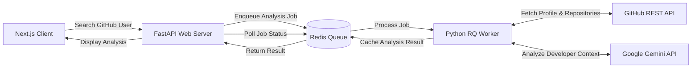

<div align="center">

# 🚀 AI GitHub Profile Analyzer

### AI-Powered GitHub Developer Intelligence & Profile Auditing

[](https://nextjs.org/)
[](https://fastapi.tiangolo.com/)
[](https://www.python.org/)
[](https://redis.io/)
[](https://ai.google.dev/)
[](LICENSE)

**Audit • Analyze • Score • Chat**

An intelligent full-stack platform that analyzes GitHub developer profiles, evaluates engineering activity, and lets you interact with repository insights using AI.

[🚀 Live Demo](#) · [🐛 Report Bug](#) · [💡 Request Feature](#)

</div>

---

## 📖 Overview

**AI GitHub Profile Analyzer** is a full-stack developer intelligence platform built for **engineering managers, recruiters, technical interviewers, and developers**.

Simply enter a GitHub username and the platform analyzes the developer's public activity, repositories, languages, contributions, and project impact to generate an **AI-assisted developer profile audit**.

The platform goes beyond traditional GitHub statistics by combining structured developer metrics with **Retrieval-Augmented Generation (RAG)** and **Google Gemini** to provide an interactive conversational experience.

> 💬 Ask questions about a developer's skills, projects, technical decisions, strengths, weaknesses, and potential role fit — all grounded in their GitHub data.

---

## ✨ Key Features

### 🤖 AI-Powered Developer Assistant

Chat naturally with an AI assistant about a GitHub developer.

Example questions:

* *"Would this developer be a good fit for a Full-Stack role?"*
* *"What are their strongest programming languages?"*
* *"Which projects demonstrate the most technical depth?"*
* *"How consistent has their contribution activity been?"*
* *"What architectural patterns can you identify from their repositories?"*

---

### 🏆 Intelligent Developer Scoring

The scoring engine evaluates multiple dimensions of developer activity, including:

* 📈 Contribution volume
* 🔥 Commit consistency
* 🌐 Language diversity
* 📦 Repository activity
* 💡 Project impact
* 🛠️ Technical breadth

The resulting score is converted into an easy-to-understand developer grade:

**S · A · B · C**

---

### 📊 Interactive Analytics

Explore developer activity through immersive visualizations:

* 📅 365-day contribution heatmap
* 📊 Programming language distribution
* 🎯 Interactive metric rings
* 📈 Contribution statistics
* 📦 Repository insights
* 🧠 AI-generated profile analysis

---

### 📄 Exportable Audit Reports

Generate professional developer audit reports suitable for:

* Engineering reviews
* Technical interviews
* Recruiting workflows
* Internal assessments
* Developer portfolios

Supported formats include:

* 📕 PDF reports using **WeasyPrint**
* 📝 Markdown reports

---

### ✨ Premium Neumorphic UI

The frontend features a modern, premium interface built around:

* 🎨 Tailwind CSS
* ✨ Framer Motion
* 🧊 Glassmorphism
* 🫧 Neumorphic components
* 🖱️ Apple-style 3D mouse parallax
* ⚡ Smooth animations and transitions
* 📱 Responsive layouts

---

### ⚡ Asynchronous Processing

Expensive GitHub aggregation and AI analysis operations are handled asynchronously using:

**Redis + RQ (Redis Queue)**

This keeps the API responsive while background workers perform heavy processing.

---

# 🏗️ Architecture

The application follows a **decoupled full-stack architecture** designed for responsiveness and scalability.

## 🧩 Tech Stack

### 💻 Frontend

| Technology               | Purpose                      |
| ------------------------ | ---------------------------- |
| **Next.js 14**           | React framework & App Router |
| **React**                | UI development               |
| **Tailwind CSS**         | Styling & design system      |
| **Framer Motion**        | Animations & interactions    |
| **TanStack React Query** | Server state & data fetching |
| **Lucide React**         | Icon system                  |

### ⚙️ Backend & Infrastructure

| Technology          | Purpose                                |
| ------------------- | -------------------------------------- |
| **FastAPI**         | REST API                               |
| **Python 3.11+**    | Backend & data processing              |
| **Pydantic**        | Data validation                        |
| **Redis**           | Queue & caching                        |
| **RQ**              | Background job processing              |
| **Google Gemini**   | AI analysis & conversational assistant |
| **WeasyPrint**      | PDF report generation                  |
| **Jinja2**          | HTML report templates                  |
| **GitHub REST API** | Developer & repository data            |

---

## 🔄 System Flow



---

# 🛠️ Getting Started

Follow the steps below to run the complete application locally.

## 1️⃣ Prerequisites

Make sure the following tools are installed:

* **Node.js** `18+`
* **Python** `3.11+`
* **Redis Server**
* **Git**
* **Cairo**
* **Pango**
* **GDK-PixBuf**

> The additional system dependencies are required by **WeasyPrint** for PDF generation.

---

## 2️⃣ Clone the Repository

```bash
git clone https://github.com/Gugilla-Aakash/AI-GitHub-Profile-Analyzer.git

cd ai-github-profile-analyzer
```

---

## 3️⃣ Configure Environment Variables

Create a `.env` file inside the `backend/` directory:

```env
GITHUB_TOKEN=your_github_personal_access_token
GEMINI_API_KEY=your_google_gemini_api_key
GROQ_API_KEY=your_groq_api_key
REDIS_URL=redis://localhost:6379/0
```

### 🔐 Environment Variables

| Variable         | Description                  |
| ---------------- | ---------------------------- |
| `GITHUB_TOKEN`   | GitHub Personal Access Token |
| `GEMINI_API_KEY` | Google Gemini API key        |
| `REDIS_URL`      | Redis connection URL         |

> ⚠️ Never commit your `.env` file or expose API keys publicly.

---

# ⚙️ Backend Setup

Open a terminal and navigate to the backend:

```bash
cd backend
```

### Create a Python Virtual Environment

```bash
python -m venv venv
```

### Activate the Environment

**macOS / Linux**

```bash
source venv/bin/activate
```

**Windows**

```bash
venv\Scripts\activate
```

### Install Dependencies

```bash
pip install -r requirements.txt
```

---

## 🔴 Start Redis

Make sure Redis is running locally on:

```text
localhost:6379
```

For example:

```bash
redis-server
```

---

## 👷 Start the Background Worker

Open **Terminal 1**:

```bash
cd backend

python worker.py
```

The worker will process GitHub analysis and AI jobs asynchronously.

---

## 🚀 Start the FastAPI Server

Open **Terminal 2**:

```bash
cd backend

uvicorn app.main:app --reload --port 8000
```

The API will be available at:

```text
http://localhost:8000
```

---

# 💻 Frontend Setup

Open another terminal:

```bash
cd frontend
```

Install dependencies:

```bash
npm install
```

Start the development server:

```bash
npm run dev
```

The frontend will be available at:

```text
http://localhost:3000
```

Open **http://localhost:3000** in your browser and start analyzing GitHub profiles. 🚀

---

# 📁 Project Structure

```text
.
├── backend/
│   ├── app/
│   │   ├── routes/             # FastAPI routes & endpoints
│   │   └── main.py             # FastAPI application entry point
│   │
│   ├── core/
│   │   ├── ai/                 # Gemini / RAG logic
│   │   └── github/             # GitHub API aggregation
│   │
│   ├── templates/              # Jinja2 PDF templates
│   ├── worker.py               # Redis Queue worker
│   ├── requirements.txt        # Python dependencies
│   └── build.sh                # Deployment / system dependencies
│
├── frontend/
│   ├── app/                    # Next.js App Router
│   ├── components/             # Reusable UI components
│   │   ├── charts/
│   │   ├── heatmap/
│   │   └── modals/
│   │
│   ├── lib/                    # API & utility functions
│   ├── public/                 # Static assets
│   ├── tailwind.config.js      # Tailwind configuration
│   └── package.json
│
├── .gitignore
├── LICENSE
└── README.md
```

---

# 🧠 How It Works

The analysis pipeline follows these major stages:

```text
GitHub Username
       │
       ▼
┌─────────────────┐
│   Next.js UI    │
└────────┬────────┘
         │
         ▼
┌─────────────────┐
│    FastAPI      │
└────────┬────────┘
         │
         ▼
┌─────────────────┐
│   Redis / RQ    │
└────────┬────────┘
         │
         ▼
┌─────────────────┐
│ Python Worker   │
└──────┬─────┬────┘
       │     │
       ▼     ▼
  GitHub API Gemini
       │     │
       └──┬──┘
          ▼
   Developer Analysis
          │
          ▼
 ┌──────────────────┐
 │ Dashboard + Chat │
 └──────────────────┘
```

---

# 🎯 Use Cases

### 👨‍💼 Engineering Managers

Quickly understand a developer's technical activity and project history.

### 🧑‍💻 Recruiters

Use GitHub activity as an additional signal during technical hiring.

### 🎓 Developers

Identify strengths, technology breadth, and areas for improvement.

### 🧑‍🏫 Technical Interviewers

Generate discussion points from real repositories and contribution history.

### 🏢 Engineering Teams

Evaluate developer profiles during internal hiring and team-building workflows.

---

# 🔮 Roadmap

Potential future improvements include:

* [ ] GitHub OAuth authentication
* [ ] Persistent user accounts
* [ ] Historical profile comparisons
* [ ] Developer-to-developer comparison
* [ ] Advanced repository architecture analysis
* [ ] Resume ↔ GitHub matching
* [ ] Team-level analytics
* [ ] More AI-powered recommendations
* [ ] Automated scheduled profile audits
* [ ] Production deployment templates
* [ ] Docker & Docker Compose support

---

# 🔐 Security

Please follow these practices when running or deploying the project:

* Never commit API keys.
* Keep `.env` files out of version control.
* Use environment variables for secrets.
* Restrict GitHub token permissions to the minimum required.
* Rotate exposed credentials immediately.
* Apply rate limiting before production deployment.

---

# 🤝 Contributing

Contributions are welcome!

### 1. Fork the repository

```bash
git clone https://github.com/Gugilla-Aakash/AI-GitHub-Profile-Analyzer.git
```

### 2. Create a feature branch

```bash
git checkout -b feature/amazing-feature
```

### 3. Commit your changes

```bash
git commit -m "feat: add amazing feature"
```

### 4. Push the branch

```bash
git push origin feature/amazing-feature
```

### 5. Open a Pull Request

Please describe the changes and include screenshots when making UI-related contributions.

---

# 📜 License

This project is licensed under the **MIT License**.

See the [LICENSE](LICENSE) file for more information.

---

<div align="center">

### ⭐ If you find this project useful, consider giving it a star!

Built with ❤️ using **Next.js · FastAPI · Redis · Python · Gemini**

</div>
