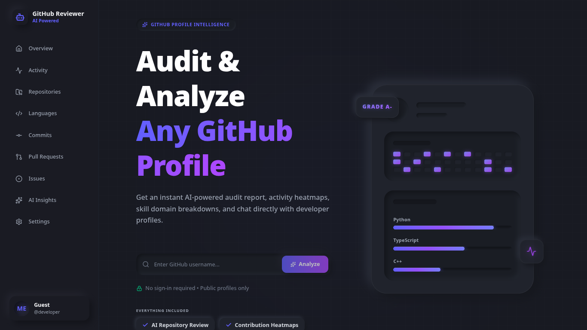
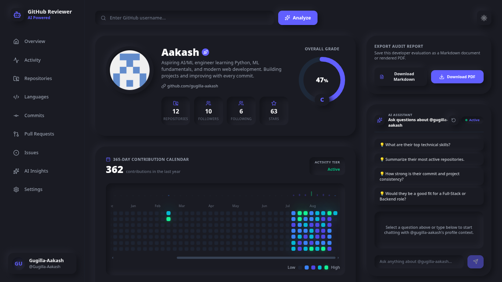
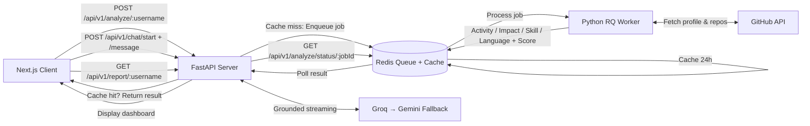

<div align="center">

# AI GitHub Profile Analyzer

### AI-Powered GitHub Developer Intelligence & Profile Auditing

[](https://nextjs.org/)
[](https://fastapi.tiangolo.com/)
[](https://www.python.org/)
[](https://redis.io/)
[](https://ai.google.dev/)
[](https://groq.com/)
[](LICENSE)

[](https://github.com/Gugilla-Aakash/AI-GitHub-Profile-Analyzer/stargazers)
[](https://github.com/Gugilla-Aakash/AI-GitHub-Profile-Analyzer/commits)
[](https://github.com/Gugilla-Aakash/AI-GitHub-Profile-Analyzer/issues)

**Audit • Analyze • Score • Chat**

An intelligent full-stack platform that analyzes public GitHub developer profiles, evaluates engineering activity across four measurable dimensions, and provides grounded, conversational insights for hiring and technical review.

[Live Demo](https://ai-git-hub-profile-analyzer.vercel.app/) · [Report Bug](https://github.com/Gugilla-Aakash/AI-GitHub-Profile-Analyzer/issues) · [Request Feature](https://github.com/Gugilla-Aakash/AI-GitHub-Profile-Analyzer/issues)

</div>

---

## Preview

<div align="center">

**Landing Page — Instant profile search, no sign-in required**


<br>

**Developer Dashboard — Score, heatmap, languages, repositories, and AI chat**


</div>

---

## Table of Contents

- [Overview](#overview)
- [Why This Matters for Hiring](#why-this-matters-for-hiring)
- [Key Features](#key-features)
- [How Scoring Works](#how-scoring-works)
- [Architecture](#architecture)
- [API Reference](#api-reference)
- [Getting Started](#getting-started)
- [Backend Setup](#backend-setup)
- [Frontend Setup](#frontend-setup)
- [Project Structure](#project-structure)
- [How It Works](#how-it-works)
- [Use Cases](#use-cases)
- [Testing](#testing)
- [Troubleshooting & FAQ](#troubleshooting--faq)
- [Roadmap](#roadmap)
- [Security](#security)
- [Contributing](#contributing)
- [License](#license)

---

## Overview

**AI GitHub Profile Analyzer** is a full-stack developer intelligence platform built for **engineering managers, recruiters, technical interviewers, and developers**.

Enter any public GitHub username and the platform:

1. Aggregates public profile data, repositories, language breakdowns, 365-day contributions, and lifetime PR / issue activity.
2. Runs deterministic analyzers for activity, impact, skill breadth, and language diversity.
3. Calculates a transparent `0-100` score with an `S / A / B / C / D` grade.
4. Builds a structured evaluation context for LLMs and enables grounded Q&A plus exportable audit reports.

The platform goes beyond vanity GitHub statistics by combining structured engineering metrics with **Retrieval-Augmented Generation (RAG)-style context** and dual LLM providers (**Groq primary, Gemini fallback**) for an interactive review experience.

> Ask questions such as hiring fit, technical depth, consistency, repository quality, and role alignment — every answer is grounded in the analyzed public GitHub data, not generic AI knowledge.

**What you get per profile:**

- Overall score and grade with a four-dimension breakdown
- 365-day contribution heatmap and activity tier
- Language distribution and domain analysis
- Repository highlights including stars, forks, README status, and ownership
- Streaming AI chat grounded in that profile
- Professional Markdown and PDF audit reports

---

## Why This Matters for Hiring

Resumes describe intent. GitHub shows execution.

This project is designed to give hiring teams a consistent, evidence-backed starting point before interviews:

- **For engineering managers:** quickly assess technical activity, project ownership, and collaboration signals without manually clicking through dozens of repositories.
- **For recruiters:** use public engineering activity as one additional screening signal alongside resume, portfolio, and interviews — not as a replacement for them.
- **For interviewers:** generate concrete discussion points from real repositories, contribution patterns, and documented work.
- **For developers:** identify strengths, stack breadth, documentation gaps, and concrete improvement actions.

> The scoring model is transparent and deterministic. AI is used for explanation and exploration, not as a black-box hiring decision.

---

## Key Features

### AI-Powered Developer Assistant

Chat naturally with an AI assistant grounded in the analyzed profile context, including scores, languages, domains, repositories, README status, and activity metrics.

Example questions hiring teams ask:

- *"Would this developer be a good fit for a Backend / Full-Stack role? Why?"*
- *"What are their strongest programming languages and where is the evidence?"*
- *"Which 2-3 repositories demonstrate the most technical depth?"*
- *"How consistent has their contribution activity been over the last year?"*
- *"What gaps should we probe in a technical interview?"*

Implementation details:

- Streaming responses via `POST /api/v1/chat/message` (`text/plain` stream)
- Groq as primary provider with automatic Gemini fallback
- Temporary Gemini circuit-breaker on quota / overload (`429`, `RESOURCE_EXHAUSTED`, `503`)
- Session history stored server-side in Redis-backed chat cache
- Chat requires a completed analysis first — the profile must exist in cache

### Intelligent Developer Scoring

Deterministic, explainable scoring across four dimensions. No hidden model. Same input produces the same score.

| Dimension | Weight | What it measures |
| --- | --- | --- |
| **Impact** | **40%** | Repository reach from stars and forks, log-scaled |
| **Activity** | **30%** | Recent 365-day consistency (70%) + lifetime PRs/issues (30%) |
| **Skill breadth** | **15%** | Domain distribution across detected technical areas |
| **Language diversity** | **15%** | Language spread with volume safeguards |

Grades:

| Grade | Score range | Interpretation for review |
| --- | --- | --- |
| **S** | `90-100` | Exceptional public signal |
| **A** | `75-89` | Strong, interview-ready signal |
| **B** | `60-74` | Solid with some gaps |
| **C** | `40-59` | Limited or inconsistent signal |
| **D** | `0-39` | Minimal public signal |
| **N/A** | `0` | Insufficient public data to rate |

See [How Scoring Works](#how-scoring-works) for formulas, activity tiers, and safeguards.

### Interactive Analytics Dashboard

Explore developer activity through structured visualizations:

- 365-day contribution heatmap built from contribution calendar weeks
- Programming language distribution with byte-level percentages
- Interactive metric rings for activity, impact, skill, and diversity
- Contribution statistics including total contributions, lifetime PRs/issues, and collaboration ratio
- Repository insights including hero repository, ownership vs. forks, and recent work
- AI-generated profile analysis context

Frontend components include `ActivityHeatmap`, `LanguageChart`, `MetricRings`, `ScoreCard`, `ProfileHeader`, `ProfileOverview`, `RepositoriesModal`, `ChatWithProfile`, `DownloadButtons`, `SearchBox`, and `SideBar`.

### Exportable Audit Reports

Generate professional developer audit reports suitable for interview packets, hiring loops, and engineering reviews.

Two formats from the same source:

- **Markdown (`?format=md`):** structured, scannable audit with KPI tables, repository assessments, role-fit matrix, and a 5-step improvement roadmap
- **PDF (`?format=pdf`):** print-ready binary generated with **WeasyPrint + Jinja2**, served as `{username}_github_audit.pdf`

Reports are LLM-synthesized from deterministic profile context and constrained to 1000-1400 words with strict grounding rules: no invented repositories or metrics. If data is insufficient, the report explicitly returns an insufficient-data audit instead of hallucinating.

### Premium, Responsive UI

The frontend is built for clarity during live hiring reviews:

- Next.js App Router with `/` search and `/profile/[username]` analysis routes
- Tailwind CSS design system with glassmorphism and neumorphic components
- Framer Motion animations including Apple-style 3D mouse parallax on the landing card
- TanStack React Query for server state and job polling
- `react-markdown + remark-gfm` for AI chat and report rendering
- Lucide icons throughout
- Responsive layouts for laptop review and mobile screening
- No sign-in required. Public profiles only.

### Asynchronous, Resilient Processing

Expensive GitHub aggregation and scoring run in the background so the API stays responsive:

- **Redis + RQ (`default` queue)** for background analysis jobs
- **Redis-backed profile cache** with 24-hour TTL (`CACHE_TTL = 86400`, key `profile:{username}`)
- **In-flight de-duplication:** concurrent requests for the same username reattach to the same job ID with a 10-minute `in_progress:{username}` lock
- **Cache-first reads:** repeat analyses return instantly with `"cached": true`
- **Explicit failure mapping:** user-not-found, org account, rate limit, timeout, and internal errors return distinct HTTP codes

---

## How Scoring Works

The scoring engine lives in `backend/app/analyzers/` with `ProfileScorer` as the final aggregator.

### Final formula

```text
final_score =
  (activity_score           * 0.30) +
  (impact_score             * 0.40) +
  (skill_score              * 0.15) +
  (language_diversity_score * 0.15)

grade =
  S if >= 90
  A if >= 75
  B if >= 60
  C if >= 40
  D otherwise
```

### Dimension logic

**1. Impact (40%) — log-scaled reach**

```text
star_score = log10(1 + stars) / log10(5001) * 100
fork_score = log10(1 + forks) / log10(1001) * 100
impact_score = star_score * 0.7 + fork_score * 0.3
```

Stars carry more weight than forks. Log scaling prevents one viral repository from dominating the entire evaluation.

**2. Activity (30%) — recency plus lifetime collaboration**

```text
recent_score = min(100, total_contributions_365 / 500 * 100)
life_score   = log10(1 + lifetime_prs + lifetime_issues) / log10(1001) * 100
activity_score = recent_score * 0.7 + life_score * 0.3

safety floor: if total_contributions_365 >= 1000, activity_score >= 90
```

Activity tiers from `ActivityAnalyzer`:

| Tier | 365-day contributions |
| --- | --- |
| `Inactive` | `0-50` |
| `Casual` | `51-250` |
| `Active` | `251-1000` |
| `Prolific` | `1000+` |

Collaboration ratio is also computed:

```text
collaboration_ratio_365 = (issues_365 + prs_365) / total_contributions_365 * 100
```

**3. Skill breadth (15%) — domain spread with volume gate**

Domain shares are converted to capped points per domain, then gated by total code volume so tiny profiles cannot score high on breadth alone:

```text
per-domain points = min(33.33, (share / 15.0) * 33.33)
raw_skill_score = sum(per-domain points), clamped to 100
volume_multiplier = min(1.0, total_bytes / 500000)
skill_score = raw_skill_score * volume_multiplier
```

**4. Language diversity (15%) — spread with the same volume gate**

```text
raw_lang_score = (diversity_score / 0.80) * 100
language_score = raw_lang_score * volume_multiplier
```

**Mastery safeguard — depth over breadth:**

```text
skill_score    = max(skill_score, impact_score)
language_score = max(language_score, impact_score)
```

A focused specialist with high-impact work in one stack is not penalized for lacking breadth.

**Insufficient-data guard:**

If a profile has no detectable languages and zero recent contributions, the scorer returns:

```json
{
  "insufficient_data": true,
  "final_score": 0,
  "grade": "N/A",
  "message": "Not enough public data to produce a meaningful rating."
}
```

This prevents misleading low scores for empty, private-heavy, or brand-new accounts.

---

## Architecture

Decoupled full-stack architecture optimized for responsiveness during long-running GitHub aggregation.

### Tech Stack

#### Frontend

| Technology | Purpose |
| --- | --- |
| **Next.js (App Router)** | React framework, routing, `/` and `/profile/[username]` |
| **React** | UI development |
| **Tailwind CSS v4** | Styling and design system |
| **Framer Motion** | Animations, parallax, transitions |
| **TanStack React Query v5** | Server state, analysis polling, caching |
| **react-markdown + remark-gfm** | AI chat and Markdown report rendering |
| **Lucide React** | Icon system |

#### Backend and Infrastructure

| Technology | Purpose |
| --- | --- |
| **FastAPI 0.100+** | REST API under `/api/v1` |
| **Python 3.11+** | Backend and data processing |
| **Pydantic + pydantic-settings** | Validation and environment config |
| **Redis** | Queue backend, profile cache, chat sessions, job locks |
| **RQ** | Background job processing on `default` queue |
| **hakiapi** | GitHub data client used by workers |
| **GitHub REST API** | Profile, repository, contribution, and search data |
| **Groq** | Primary streaming chat and report LLM |
| **Google Gemini** | Fallback streaming chat and primary report LLM |
| **WeasyPrint + Jinja2 + Markdown** | PDF and Markdown audit report generation |
| **Pytest** | Backend test suite |

### System Flow



### Job lifecycle

```text
POST /analyze/{username}
  → cached profile? return { status: completed, cached: true }
  → denylisted system account? return 400
  → in-progress job exists? return existing { job_id, queued|started }
  → else enqueue analyze_profile_task, set 10-min lock, return { job_id, queued }

GET /analyze/status/{job_id}
  → finished → { status, result }
  → failed   → mapped 404 / 429 / 504 / 500
  → queued|started → { status, message: still in progress }
```

---

## API Reference

Base path: `/api/v1`. Local base URL defaults to `http://localhost:8000`.

Health checks are available at `GET /` and `GET /health`.

| Method | Endpoint | Description |
| --- | --- | --- |
| `POST` | `/api/v1/analyze/{username}` | Start analysis or return cached profile. Returns `job_id` or completed result. |
| `GET` | `/api/v1/analyze/status/{job_id}` | Poll background job. Returns `finished` with result or mapped error. |
| `GET` | `/api/v1/search?q={query}` | Search GitHub users for autocomplete. Returns `login` and `avatar_url`. |
| `POST` | `/api/v1/chat/start/{username}` | Initialize grounded chat session. Requires cached analysis. Returns `session_id`. |
| `POST` | `/api/v1/chat/message` | Stream chat response. Body: `{ session_id, message }`. Returns `text/plain` stream. |
| `GET` | `/api/v1/report/{username}?format=md` | Generate Markdown audit report. Requires cached analysis. |
| `GET` | `/api/v1/report/{username}?format=pdf` | Generate PDF audit report download. Requires cached analysis. |

### Example: start and poll analysis

```bash
curl -X POST http://localhost:8000/api/v1/analyze/octocat

# Response (queued):
# { "job_id": "<rq-job-id>", "status": "queued", "message": "Analysis queued..." }

curl http://localhost:8000/api/v1/analyze/status/<rq-job-id>

# Response (finished):
# { "status": "finished", "result": { "username": "octocat", "final_score": 82, "grade": "A", ... } }
```

### Example: chat after analysis

```bash
curl -X POST http://localhost:8000/api/v1/chat/start/octocat
# { "session_id": "<uuid>", "username": "octocat", "message": "Chat session initialized." }

curl -X POST http://localhost:8000/api/v1/chat/message \
  -H "Content-Type: application/json" \
  -d '{"session_id":"<uuid>","message":"Is this profile a good fit for a backend role?"}'
```

### Example: download reports

```bash
curl -OJ http://localhost:8000/api/v1/report/octocat?format=md
curl -OJ http://localhost:8000/api/v1/report/octocat?format=pdf
```

### Error mapping

| Situation | HTTP code |
| --- | --- |
| System account (`ghost`, `dependabot`, `github-actions`, etc.) | `400` |
| GitHub user not found or is an Organization | `404` |
| Chat/report requested before analysis | `404` |
| Job ID not found | `404` |
| GitHub rate limit exceeded | `429` |
| GitHub request timeout | `504` / `529` for search |
| Redis unavailable | `503` |
| Analysis worker failure | `500` |

---

## Getting Started

Run the complete application locally. No production backend configuration is required.

### 1. Prerequisites

| Tool | Minimum version | Notes |
| --- | --- | --- |
| **Node.js** | `18+` | Frontend dev server |
| **Python** | `3.11+` | Backend API and worker |
| **Redis Server** | `6+` | Queue, cache, chat sessions on `localhost:6379` |
| **Git** | any recent | Clone and contributing |
| **Cairo / Pango / GDK-PixBuf / libffi** | system packages | Required by WeasyPrint for PDF export |

Install system dependencies for WeasyPrint:

**Ubuntu / Debian:**

```bash
sudo apt-get update && sudo apt-get install -y \
  libcairo2 libpango-1.0-0 libpangocairo-1.0-0 \
  libgdk-pixbuf2.0-0 libffi-dev shared-mime-info
```

**macOS (Homebrew):**

```bash
brew install cairo pango gdk-pixbuf libffi
```

**Windows:**

Use WSL2 with Ubuntu for the backend. Native WeasyPrint system setup on Windows is fragile and not recommended for this project.

### 2. Clone the Repository

```bash
git clone https://github.com/Gugilla-Aakash/AI-GitHub-Profile-Analyzer.git
cd AI-GitHub-Profile-Analyzer
```

### 3. Configure Environment Variables

Create `backend/.env`:

```env
GITHUB_TOKEN=your_github_personal_access_token
GEMINI_API_KEY=your_google_gemini_api_key
GROQ_API_KEY=your_groq_api_key
REDIS_URL=redis://localhost:6379/0
```

Create `frontend/.env.local`:

```env
NEXT_PUBLIC_API_URL=http://localhost:8000
```

> Use your own local backend URL only. Do not commit `.env` or `.env.local` files. Both are already ignored via `.gitignore`.

| Variable | Required | Description |
| --- | --- | --- |
| `GITHUB_TOKEN` | Yes | GitHub Personal Access Token. Increases rate limits for aggregation and search. |
| `GEMINI_API_KEY` | Yes | Google Gemini API key for fallback chat and report generation. |
| `GROQ_API_KEY` | Yes | Groq API key for primary streaming chat and report fallback. |
| `REDIS_URL` | Yes | Redis connection URL. Defaults to `redis://localhost:6379/0`. |
| `NEXT_PUBLIC_API_URL` | Yes (frontend) | Local backend base URL consumed by `frontend/lib/api.ts`. Keep as `http://localhost:8000` for local runs. |
| `CACHE_TTL` | No | Profile cache TTL in seconds. Defaults to `86400` (24 hours). |

Token setup:

- GitHub: `GitHub Settings → Developer settings → Personal access tokens → Fine-grained or Classic`. Public data only is sufficient. Restrict scopes to minimum read-only public access.
- Gemini: Google AI Studio → API key.
- Groq: Groq console → API key.

---

## Backend Setup

All commands run from `backend/`.

```bash
cd backend
```

### Create and activate a virtual environment

```bash
python -m venv venv
```

**macOS / Linux:**

```bash
source venv/bin/activate
```

**Windows (PowerShell):**

```bash
venv\Scripts\activate
```

### Install dependencies

```bash
pip install -r requirements.txt
```

### Start Redis

Redis must be reachable at `localhost:6379` unless you override `REDIS_URL`.

```bash
redis-server
```

Verify:

```bash
redis-cli ping
# Expected: PONG
```

### Start the background worker

Open **Terminal 1**:

```bash
cd backend
source venv/bin/activate
python worker.py
```

Expected output:

```text
Starting RQ worker...
```

Keep this terminal running. It processes GitHub aggregation, analyzers, scoring, and caching.

### Start the FastAPI server

Open **Terminal 2**:

```bash
cd backend
source venv/bin/activate
uvicorn app.main:app --reload --port 8000
```

API available at:

```text
http://localhost:8000
```

Interactive docs:

```text
http://localhost:8000/docs
```

Health check:

```bash
curl http://localhost:8000/health
# { "status": "healthy", "service": "github-analyzer Backend" }
```

---

## Frontend Setup

Open **Terminal 3**:

```bash
cd frontend
npm install
npm run dev
```

Frontend available at:

```text
http://localhost:3000
```

Open `http://localhost:3000`, search a public GitHub username, wait for the queued analysis to finish, then explore the dashboard, chat, and report downloads.

Useful scripts:

```bash
npm run dev    # local development
npm run build  # production build check
npm run start  # serve production build locally
npm run lint   # Next.js lint
```

---

## Project Structure

```text
.
├── backend/
│   ├── app/
│   │   ├── main.py               # FastAPI app, CORS, /api/v1 routers, health checks
│   │   ├── config.py             # pydantic-settings: tokens, Redis URL, CACHE_TTL
│   │   ├── tasks.py              # analyze_profile_task: fetch → analyze → score → cache
│   │   ├── api/routes/
│   │   │   ├── analyze.py        # POST /analyze/{username}, GET /analyze/status/{job_id}
│   │   │   ├── chat.py           # POST /chat/start/{username}, POST /chat/message stream
│   │   │   ├── report.py         # GET /report/{username}?format=md|pdf
│   │   │   └── search.py         # GET /search?q=
│   │   ├── analyzers/
│   │   │   ├── activity_analyzer.py
│   │   │   ├── impact_analyzer.py
│   │   │   ├── language_analyzer.py
│   │   │   ├── skill_analyzer.py
│   │   │   └── scorer.py         # 40/30/15/15 weighting + S/A/B/C/D grades
│   │   ├── cache/
│   │   │   ├── simple_cache.py   # profile:{username} JSON cache with 24h TTL
│   │   │   └── chat_cache.py     # chat sessions + Gemini circuit-breaker
│   │   ├── clients/
│   │   │   ├── github_client.py
│   │   │   └── llm/
│   │   │       ├── gemini_provider.py
│   │   │       └── groq_provider.py
│   │   ├── llm/
│   │   │   └── profile_context.py # deterministic RAG-style evaluation context
│   │   └── reports/
│   │       ├── markdown_report.py # LLM-synthesized hiring audit, 1000-1400 words
│   │       └── pdf_report.py      # Markdown → WeasyPrint PDF conversion
│   ├── tests/                    # Pytest suite: analyzers, API, cache, LLM, reports
│   ├── worker.py                 # RQ worker on `default` queue
│   ├── requirements.txt
│   ├── pytest.ini
│   ├── build.sh                  # system deps for WeasyPrint
│   └── start.sh
│
├── frontend/
│   ├── app/
│   │   ├── page.tsx              # Landing + search + animated preview card
│   │   ├── layout.tsx
│   │   ├── globals.css
│   │   └── profile/[username]/page.tsx  # Dashboard route
│   ├── components/
│   │   ├── SearchBox.tsx
│   │   ├── ProfileHeader.tsx
│   │   ├── ProfileOverview.tsx
│   │   ├── ScoreCard.tsx
│   │   ├── MetricRings.tsx
│   │   ├── CircularRing.tsx
│   │   ├── ActivityHeatmap.tsx
│   │   ├── LanguageChart.tsx
│   │   ├── RepositoriesModal.tsx
│   │   ├── ChatWithProfile.tsx
│   │   ├── DownloadButtons.tsx
│   │   ├── SideBar.tsx
│   │   └── SettingsModal.tsx
│   ├── lib/api.ts                # typed API client: analyze, status, chat, reports
│   ├── providers/
│   ├── public/
│   ├── tailwind.config.js
│   ├── next.config.js
│   └── package.json
│
├── assets/
│   └── screenshots/
│       ├── landing-page.png
│       └── dashboard-analysis.png
│
├── .gitignore
├── LICENSE
└── README.md
```

---

## How It Works

End-to-end local pipeline:

```text
GitHub Username
        │
        ▼
┌─────────────────┐
│   Next.js UI    │  Search + autocomplete + polling
└────────┬────────┘
         │
         ▼
┌─────────────────┐
│    FastAPI      │  Cache check → enqueue or return cached
└────────┬────────┘
         │
         ▼
┌─────────────────┐
│   Redis / RQ    │  default queue + profile cache + job lock
└────────┬────────┘
         │
         ▼
┌─────────────────┐
│ Python Worker   │  analyze_profile_task
└──────┬─────┬────┘
       │     │
       ▼     ▼
  GitHub API  Analyzers
       │     │
       └──┬──┘
          ▼
   ProfileScorer (0-100 + grade)
          │
          ▼
 ┌──────────────────┐
 │ Dashboard + Chat │  Heatmap, languages, repos, streaming Q&A
 └────────┬─────────┘
          │
          ▼
 ┌──────────────────┐
 │ MD / PDF Reports │  Grounded hiring audit export
 └──────────────────┘
```

Worker internals (`backend/app/tasks.py`):

1. Fetch full public profile data via GitHub client.
2. Extract repositories, language breakdown, 365-day contributions, lifetime PRs/issues.
3. Run `LanguageAnalyzer`, `ImpactAnalyzer`, `SkillAnalyzer`, `ActivityAnalyzer` in parallel conceptually.
4. Calculate final score and grade with `ProfileScorer`.
5. Trim top/recent repositories and recent PRs/issues for LLM context.
6. Store combined payload in Redis for dashboard, chat, and reports.

Chat internals (`backend/app/api/routes/chat.py`):

1. `POST /chat/start/{username}` builds deterministic context from cached profile.
2. `POST /chat/message` streams Groq first.
3. On Groq failure, automatically falls back to Gemini unless temporarily disabled.
4. Full response is appended to session history for follow-up questions.

---

## Use Cases

### Engineering Managers

Quickly understand technical activity, ownership, documentation hygiene, and collaboration before a hiring conversation. Use the score breakdown to decide where to probe deeper, not as a hiring verdict.

### Recruiters

Add public engineering activity as one structured signal in technical screening. The executive summary, role-fit matrix, and repository highlights translate GitHub activity into review-ready language.

### Technical Interviewers

Generate targeted interview prompts from real evidence: strongest repositories, language depth, contribution consistency, README quality, and improvement areas. Every claim in the report maps back to visible profile data.

### Developers

Audit your own public profile the way reviewers see it. Identify missing READMEs, license gaps, inactive periods, narrow domain exposure, and concrete next steps from the improvement roadmap.

### Engineering Teams

Use consistent audit structure for internal mobility reviews, contractor evaluation, open-source collaborator screening, and portfolio assessments.

---

## Testing

Backend has a comprehensive Pytest suite covering analyzers, API routes, caching, providers, reports, tasks, and workers.

```bash
cd backend
source venv/bin/activate
pytest
```

Verbose run:

```bash
pytest -v
```

Run a single area:

```bash
pytest tests/test_scorer.py -v
pytest tests/test_analyze.py -v
pytest tests/test_chat.py -v
pytest tests/test_report.py -v
```

Test files include:

`test_activity_analyzer`, `test_impact_analyzer`, `test_language_analyzer`, `test_skill_analyzer`, `test_scorer`, `test_tasks`, `test_profile_context`, `test_simple_cache`, `test_chat_cache`, `test_analyze`, `test_search`, `test_chat`, `test_report`, `test_markdown_report`, `test_pdf_report`, `test_github_client`, `test_gemini_provider`, `test_groq_provider`, `test_main`, `test_worker`.

Frontend checks:

```bash
cd frontend
npm run lint
npm run build
```

---

## Troubleshooting & FAQ

**Analysis stays `queued` or `started`?**

- Ensure `python worker.py` is running in a separate terminal.
- Ensure Redis is running: `redis-cli ping` should return `PONG`.
- Check worker logs for GitHub API errors.

**`GitHub API rate limit exceeded (429)`?**

- Add or rotate `GITHUB_TOKEN` in `backend/.env`.
- Wait for rate-limit reset, then retry.
- Cached profiles continue to work during rate limits.

**`GitHub user not found or is an Organization account (404)`?**

- Verify username spelling and that the account is a public user, not an organization.
- Private-heavy or empty accounts may return `insufficient_data` with grade `N/A`.

**`Cannot analyze ghost / dependabot / github-actions (400)`?**

- System and bot accounts are intentionally denylisted to prevent meaningless audits.

**Chat says `Profile not found. Analyze the profile first (404)`?**

- Chat and reports require a completed analysis because they read from Redis cache.
- Run `POST /api/v1/analyze/{username}` and wait for `finished` before starting chat.

**Chat stream fails or returns provider failure?**

- Verify both `GROQ_API_KEY` and `GEMINI_API_KEY`.
- Groq is tried first; Gemini is automatic fallback.
- Gemini is temporarily disabled for 5 minutes after quota/overload errors, then re-enabled automatically.

**PDF generation fails (500)?**

- WeasyPrint system libraries are missing.
- Reinstall OS packages from [Getting Started](#getting-started) and reinstall `pip install -r requirements.txt`.
- On Windows, use WSL2.

**Frontend cannot reach backend?**

- Confirm backend is on `http://localhost:8000/health`.
- Confirm `frontend/.env.local` contains `NEXT_PUBLIC_API_URL=http://localhost:8000`.
- Restart `npm run dev` after changing frontend env vars.

**Repeated requests are instant?**

- Expected. Successful profiles are cached for 24 hours as `profile:{username}`.
- Concurrent duplicate requests attach to the same RQ job ID instead of spawning duplicate work.

**CORS errors locally?**

- Local `http://localhost:3000` and `http://127.0.0.1:3000` are already allowed in `backend/app/main.py`.
- If you change frontend ports, update `ALLOWED_ORIGINS` accordingly.

---

## Roadmap

Future improvements under consideration:

- [ ] GitHub OAuth authentication
- [ ] Persistent user accounts
- [ ] Historical profile comparisons
- [ ] Developer-to-developer comparison
- [ ] Advanced repository architecture analysis
- [ ] Resume ↔ GitHub matching
- [ ] Team-level analytics
- [ ] More AI-powered recommendations
- [ ] Automated scheduled profile audits
- [ ] Production deployment templates
- [ ] Docker & Docker Compose support

Have a hiring workflow this should support? Please open a feature request with your use case.

---

## Security

Please follow these practices when running the project locally:

- Never commit API keys or `.env` files. Both backend and frontend env files are git-ignored.
- Use environment variables for all secrets.
- Restrict GitHub token permissions to minimum read-only public access.
- Rotate any exposed credentials immediately.
- Do not publish private backend URLs in issues, screenshots, or forks.
- Apply rate limiting, authentication, and restricted CORS before any production deployment.
- Treat AI output as assistive review material, not an automated hiring decision.

To report a security concern, please open a private security advisory or contact the maintainer instead of filing a public issue.

---

## Contributing

Contributions are welcome, especially around scoring transparency, report quality, UI clarity, tests, and documentation.

### 1. Fork and clone

```bash
git clone https://github.com/Gugilla-Aakash/AI-GitHub-Profile-Analyzer.git
cd AI-GitHub-Profile-Analyzer
```

### 2. Create a feature branch

```bash
git checkout -b feature/amazing-feature
```

### 3. Make changes with tests

```bash
# Backend
cd backend
pytest tests/test_scorer.py -v

# Frontend
cd ../frontend
npm run lint
npm run build
```

### 4. Commit

```bash
git commit -m "feat: add amazing feature"
```

### 5. Push and open a Pull Request

```bash
git push origin feature/amazing-feature
```

Please include:

- Clear description and hiring/review motivation
- Screenshots or GIFs for UI changes
- New or updated tests for backend logic
- No secrets, local URLs, tokens, or generated PDFs in the diff

---

## License

This project is licensed under the **MIT License**.

See the [LICENSE](LICENSE) file for details.

---

<div align="center">

### If this project helps your hiring or engineering reviews, please consider giving it a star.

Built with **Next.js · FastAPI · Redis · Python · Groq · Gemini**

*Public GitHub activity only. No sign-in required.*

</div>
